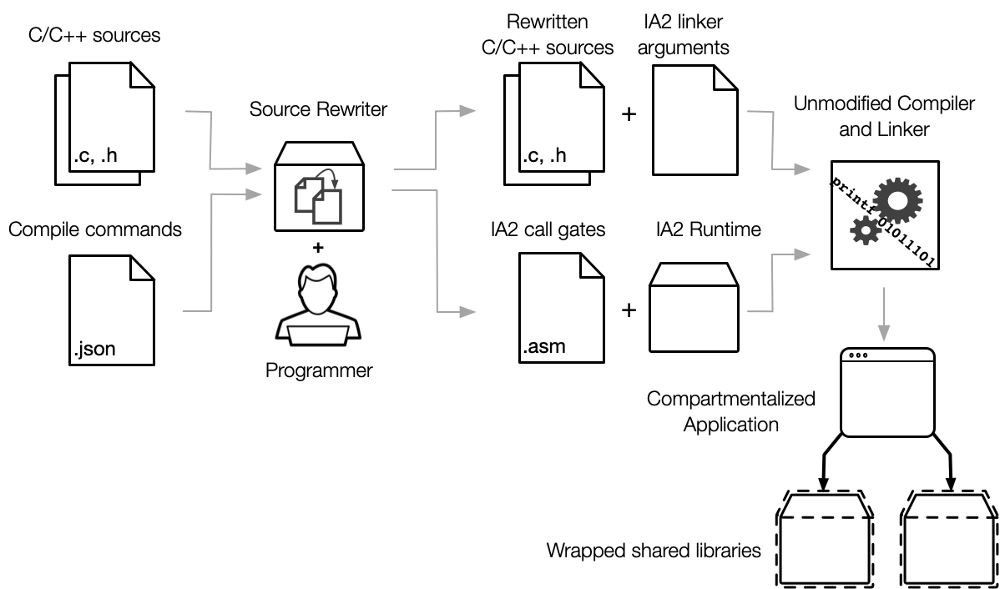

# Compartmentalization design

IA2 is a sandboxing framework with the following goals:

1. Allow sandboxing individual processes at the dynamic shared object (DSO) granularity
2. Allow inspection of code inserted by the framework
3. Avoid changes to existing compilers and linkers
4. Avoid changes to the operating system or dynamic linker

IA2 can be used in conjunction with multi-process sandboxing and is particularly
suitable for processes that can't feasibly be split into more processes. The x86
implementation relies on Memory Protection Keys (MPK) for protecting pages and
control-flow integrity (e.g. as provided by Intel's CET). It currently only
supports Linux, but its design does not preclude porting it to other operating
systems that provide access to the previously mentioned hardware primitives.

# Protected memory

Compartmentalization protects applications against spatial memory-safety
vulnerabilities in dependencies by placing sets of DSOs in separate
compartments. Memory belonging to each set of DSOs can only be accessed from its
compartment by default. This includes stack variables, static and
dynamically-allocated data, and thread-local storage. The on-disk application
and libraries are assumed to be accessible to attackers, so read-only static
data is not protected from other compartments since it can just be read from the
binaries.

# Building compartmentalized applications

The following diagram shows the workflow for building compartmentalized
applications.

The build process works by adding a source code rewriting step before each
build. This creates new source files which are then passed on to an existing
build system with some additional standard compiler flags. The rewriter also
generates a source file with application-specific call-gate code and the
framework provides a static library that must also be linked in.

## Supported compilers and linkers

The framework is routinely tested with gcc and clang as compilers and LLVM's lld
and GNU ld as linkers. The gold linker is currently not supported due to its
minimal support for linker scripts. Other compilers may be added as the need
arises.

# Runtime Initialization

The runtime initialization happens by interposing `main` using `ld --wrap=main`.
The `main` wrapper switches from the stack initialized by the loader to a
protected stack for the main binary's compartment, initializes the PKRU
register to set memory access permissions for the initial compartment, and then calls
the real `main` provided by the application. Once the real `main` returns, the
wrapper undoes these operations before returning control to the C runtime. This
implies protecting against vulnerabilities in the C runtime is out of scope.

The `INIT_RUNTIME` macro must also be invoked to initialize the stacks and
thread-local storage used by each compartment. Applications require one stack
per (compartment * thread), so to minimize memory usage only one stack per
compartment is initially created and further sets of compartment stacks are
allocated on-demand as new threads are created.

# Compartment initialization

When DSOs are loaded, their writable statically-allocated memory is protected using
`pkey_mprotect`. This happens by including [`ia2_compartment_init.inc`](../runtime/libia2/include/ia2_compartment_init.inc) in one DSO
per compartment. This inserts a constructor (called automatically) that uses
`dl_iterate_phdr` to find the writeable ELF segments for the DSO and its
dependencies declared using `IA2_COMPARTMENT_LIBRARIES`.

# Framework code interposition

Calls to DSOs in different compartments are interposed using call gates. To
provide build-time assurance that call gates cannot be misused, they are
application-specific and generated by the rewriter. Direct cross-compartment
calls are identified by the `__wrap_` prefix. To ensure that compartments can be
mutually distrusting, indirect cross-compartment calls are split into sets of
two half call gates that uses an intermediate PKRU value without access to any
compartment. For each potential indirect call, the rewriter inserts the first
half call gate at the callsite and replaces the function pointer expression with
the second half call gate. To ensure that roundtrip casts between `void *` and
function pointers do not lead to missing call gates, the rewriter also changes
function pointer types in the rewritten sources to ABI-compatible structs.
